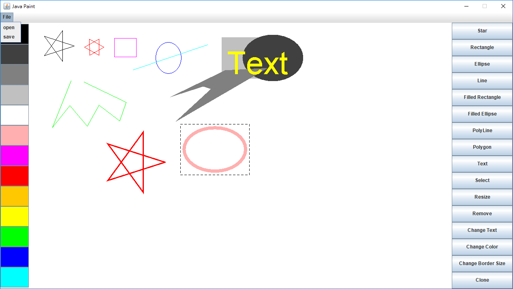
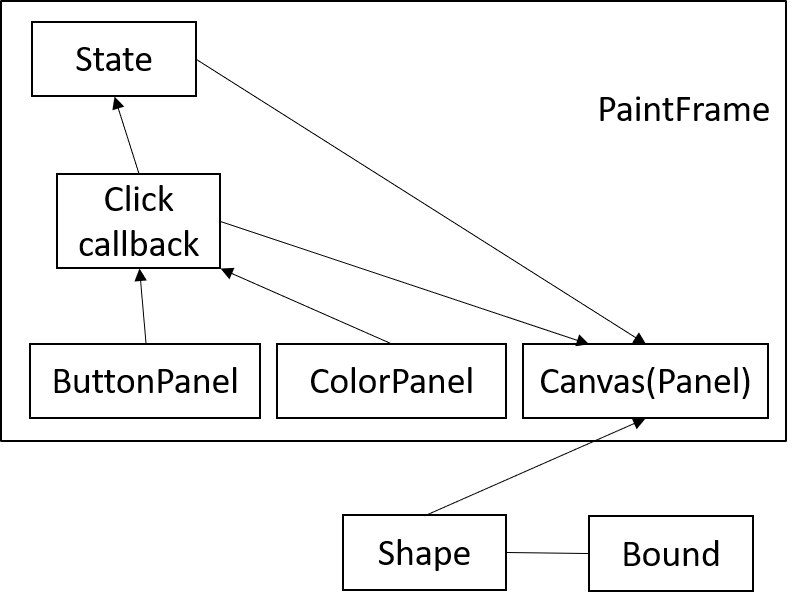

# MiniCAD

3160100052 陈翰逸 计算机科学与技术


## 功能简述

依照课程要求，本次作业实现了以下功能：

1. 能用鼠标绘制:
    - 线段 
    - 矩形 
    - 椭圆
    - 填充的矩形 
    - 填充的椭圆
    - 多点折线
    - 多边形和
    - 文字块
    - 星<span style="color: red">(额外功能)</span>
2. 可以用鼠标选中已经绘制的图形
3. 可以移动选中的图形
4. 可以修改选中的图形的:
    - 颜色
    - 大小
    - 线条粗细
    - 文字内容
5. 可以删除选中的图形
6. 可以将所绘制的图形保存在文件中
7. 可以将保存的文件中的图形加载到当前的图形中
8. 复制已经存在划布上的图形<span style="color: red">(额外功能)</span>





## 架构



- ```PaintFrame```是整个程序的外层框架，必须由他启动各个部件。
- ```State```是放在```PaintFrame```中的一个作为全局的状态机，描述当前的操作、当前划笔大小、颜色等信息。
- 由```ColorPanel```,```ButtonPanel```控制状态机，利用```callback```函数将信息写入状态机。
- ```Canvas```控制鼠标的位置、动作，依照状态机中的状态执行相应的操作。
- ```Shape```, ```Bound```会在```Canvas```中依照鼠标以及状态机的信息被构造以及调用。


## 与图形相关的类

### ```Bound```

用来描述图形的边界，用于选中、移动之类的操作，一般由```Shape```类的```Bound getBound()```构造。

边界的信息：```left```, ```top```, ```width```, ```height```。也就是用矩形来描述。


### ```Shape```

这是一个抽象类，作为所有能在划布上划出的形状的父类。
这个类包含了几个方法：

- ```void setColor(Color color)```
- ```void setSize(float size)```
- ```Type getType()```
- ```void move(int dx, int dy)```
- ```void resize(int x, int y)```
- ```void drag(int firstX, int firstY, int previousX, int previousY, int x, int y)```
- ```void render(Graphics2D g)```
- ```Bound getBound()```

这些方法提供```Canvas```类调用，让划布能够控制每一个图形。


### ```Shape```的子类:

#### ```Text```

用成员变量```String text```保存了文字内容，取得```bound```需要仰赖```FontRenderContext```以及```Font.getStringBounds()```这两个类、函数。


#### ```Rectangle```, ```FilledRectangle```, ```Ellipse```, ```FilledEllipse```

维护x, y的起点、终点即可。


#### ```Polygon```, ```PolyLine```

维护x, y的数组。对于除了缩放以外、其他功能都是比较容易实现的。

缩放多个点，可以利用矩阵变换坐标：

$$
M_\text{scale} =
\begin{pmatrix}
S_x & 0 & 0 \\
0 & S_y & 0 \\
0 & 0 & 1 \\
\end{pmatrix}
, ~
M_\text{translation} =
\begin{pmatrix}
1 & 0 & X \\
0 & 1 & Y \\
0 & 0 & 1 \\
\end{pmatrix}
$$

放大后新的坐标就是$(\hat{x_i}, \hat{y_i}, 1) ^ T = M_\text{translation} ~ M_\text{scale} ~ (x_i, y_i, 1) ^ T$

不过因为矩阵运算比较麻烦，实现的方法是直接展开矩阵运算的结果。


#### ```Line```

维护起点与终点即可。


#### ```Star```

维护起点、终点，通过计算星的中心点。

$N$个点的星，点$P_k = (w\cos\theta_k, w\sin\theta_k), ~ \theta_k = \frac{\pi k}{N} ~ (1 \leq k \leq N)$


## 状态机

用```State```描述，```State```有以下几个成员变量:
- ```String text```
- ```Shape.Type shapeType```
- ```Task task```
- ```Color color```
- ```float size```
- ```int points```


## 按钮

因为```callback```本身没有办法取状态机的值，需要在```Listener```中用成员变量的形式存指向状态机的指针，因此另外定义了一个```ClickListener```类，包含成员变量```State state```，接着像如下的代码就能新增按钮。


```Java
ButtonPanel panel = this;
this.add(
    new JButton("Rectangle") {
      {
        this.addActionListener(
            new ClickListener(state) {
              @Override
              public void actionPerformed(ActionEvent e) {
                this.state.setShapeType(Shape.Type.RECTANGLE);
                this.state.setTask(State.Task.DRAW);
              }
            });
      }
    });
```


## 对象序列化

```Shape```实现了```Serializable```接口，接着只要用:

输出
- ```FileOutputStream```
- ```ObjectOutputStream```

输入
- ```FileInputStream```
- ```ObjectInputStream```

就能把整个```ArrayList<Shape>```写回文件以及从文件读出。


## ```Canvas```

```Canvas```作为控制器。

主要控制状态机、图形对象，还有几个鼠标事件:

- ```mousePressed```
- ```mouseDragged```
- ```mouseReleased```
- ```mouseMoved```

